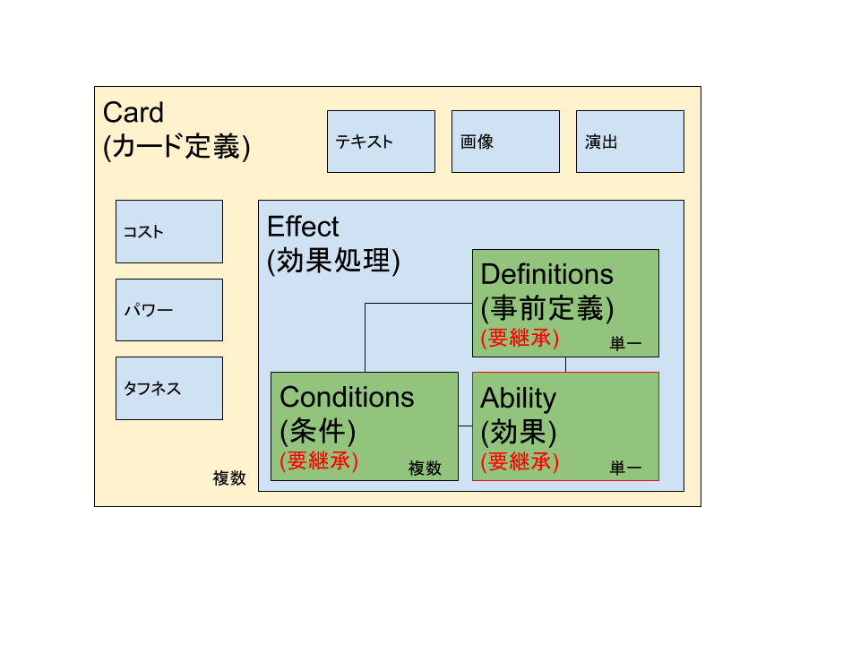

# Bridgeパターン

Bridgeパターンは、橋渡しと呼ばれていますが、実際には実装をうまく分離するパターンです。  
interfaceでもうまくやれますが、interfaceの実装を使いまわしたいときには有用なデザインパターンです。  

## 用途

カードゲームのような、「カード」と「効果の実装」をわけるケースで活用できます。  

カードゲームで、効果ごとにカードクラスを作るのは嫌ですよね。  
継承でうまくやるとしても、タイミングの問題とかで、ベースクラスにたくさん仮想関数を追加する必要が出てきますよね。  
そうすると、無駄な関数が増えて嫌ですよね。  

なので、カードゲームの場合、「効果を実装する人」を用意します。  

## カードゲームの設計例

実際に運用したことのあるカードゲーム設計です。  

  

カードに設定すべき情報と、効果を分離しています。  
Effectはひとつのカードに複数持てます。  

ひとつの効果処理は、ひとつの効果クラス、複数の条件、ひとつの事前定義クラスから構成していました。  
こうすることで、「任意の対象に1ダメージ」「ダメージを受けている敵に4ダメージ」「全体に6ダメージ」「次のターン開始時に3ダメージ」などの処理を、最小限の実装で使いまわすことができます。  

## adventure-cubeでの実装

UIのパラメータ表示クラスで使用します。  
