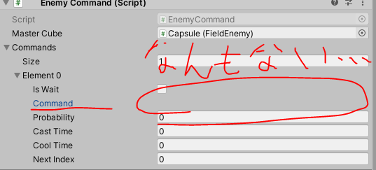

# Polymorphic Serialization

注意： Unity 2019.3.12f1以上でのみ使える機能です。


## SerializeReference
interfaceとかvirtual使った抽象クラスの派生先は、基本的にはシリアライズは不可能です。  
ゲームを作りこむうえで、継承を活用したデータを作ることもあると思います。  
派生クラスをデータとして格納したいとき、Editor拡張が必要だったり、自分で関数を作って、別手段で保存する(もちろん復元もやる)という必要があり、対応が面倒でした。  

たとえば、装備にAbilityクラスを入れて、それぞれのアビリティの効果をインスペクタ上で調整するみたいなことや、  
カードゲームで効果を複数設定したいときなどが考えられます。  

しかし、Unity 2019.3から実装されたPolymorphic Serializationと言う機能によって、その問題をUnity側がサポートしてくれるようになりました。  
ここのとき、Serialize Referenceというキーワードをソースコードに着けます。  
なので、この関連の機能は、Serialize Referenceと呼ばれることもあります。  


## 実例(サポートクラスなし)

こんなな感じに書けばいい…

```
[Serializable]
class EnemyCommandSet
{
        public bool IsWait = true;
        [SerializeReference]
        public ICommand Command;
        public int Probability = 1;
        public float CastTime = 0;
        public float CoolTime = 0;
        public int NextIndex = -1;
}

[SerializeField]
List<EnemyCommandSet> Commands = new List<EnemyCommandSet>();
```

#### やってみたよ



「……」

## そういうことじゃない

Editorに出てくるまでセットだろう…と思ったので、ここをサポートするEditor拡張を作ります。  

一応誰かが作ってくれたものをベースにしましたが、完全ではなかったので手直しをしました。  
https://qiita.com/tsukimi_neko/items/7922b2433ed4d8616cce  

それぞれ、プロジェクト内にある  
SubclassSelectorAttribute.csと、SubclassSelectorDrawer.csが該当します。

# 完成！！

SerializeReferenceのよこに、SubclassSelectorを追加してください。  
これは↑で作ったEditor拡張の機能を使用するよ、という命令です。  
Editor拡張側のコードでやってますが、interfaceの派生型を勝手に検索して、型に一致しているものをリストアップしてくれます。  

```
[SerializeReference, SubclassSelector]
public ICommand Command;
```

### 参考ソース
[EnemyCommand.cs](https://github.com/vtn-team/adventure-cube/blob/develop/Assets/Script/Game/Enemy/EnemyCommand/EnemyCommand.cs)