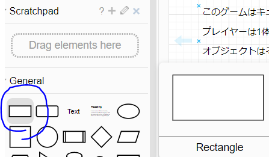

# クラスの関係性を意識する
ここでは、プログラムを書き始める前、設計を考える前に、まず頭を整理することを考えよう、という話をします。  

## 設計で大事なのは、関係性
「どのオブジェクトが、どいつに命令するんだっけ？」  
「この処理はどのオブジェクトが実行するんだっけ？」  
というのがうまく考えられていないと、プレイヤーが全部やります！ ドーン！  
みたいなクラス設計になって、のちのちの機能追加とかで苦労したりするわけです。  

## 「モデル図」を書いてみよう
- ゲーム中にどんなオブジェクトがあるんだっけ？
- ゲーム中にオブジェクト間でどういった処理が挟まるんだっけ？

というのを図にしてみましょう。  
図にするのが一番わかりやすいです。  

図は[draw.io](https://app.diagrams.net)というサイトを使用して書きます。    
最初Googleアカウントで認証して、Google Driveに保存しましょう。  
他にもいろんなお絵かき用ツールがありますが、このツールが一番書きやすく、共有もしやすくて便利です。  

## 参考モデル図
[これ](https://drive.google.com/file/d/1AGBb4x475yDodN1rEB2hy7n1GNDGUomo/view?usp=sharing)を参考にしてください

## 書き方

### オブジェクト
この□をドラッグ＆ドロップ

### 見出しとテキスト
図のアイコンをドラッグ＆ドロップ

### 線でつなぐ
図の端をマウスオーバーすると緑の点が出てきます。  
この状態でつなげたい□までドラッグしてください。  

## コツ
ゲーム中、シーンが切り替わるなどで、ゲーム内にあるオブジェクトがガラっと変わる場合は、別のシートを作りましょう。  
最終的に同じシーンに存在することになっても構いません。  

とりあえずは、自分なりにわかりやすい書き方で構いません。  

## UIについて
UI関係は入れると複雑な図になります。  
UIは基本的にはゲーム中の状態を参照するので、設計としてはどうアクセスするか/どう更新するかが重要になります。  
設計の根幹を変える実装もないと思うので、いったん別のシートにするか、レイアウト図を書くなど、別の手段で表現するほうがいいかなーと思います。  
